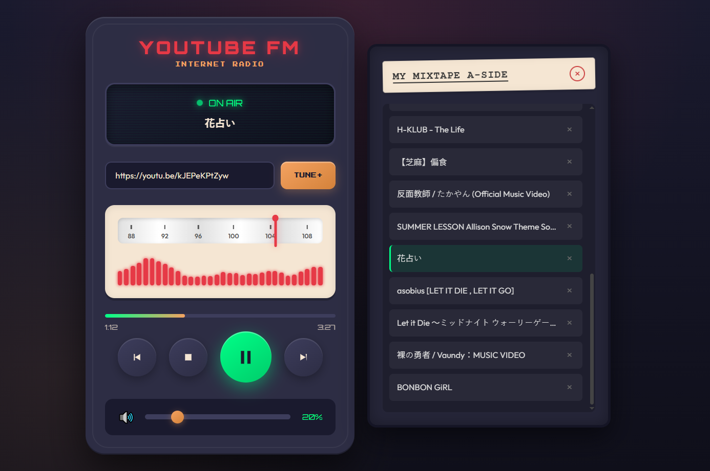

> ⚠️ **Warning: This project is an example of "Vibe Coding" created by OPENCODE with Gemini 3 Pro.**

# YouTube FM - Retro Internet Radio

A nostalgic, retro-styled web radio player that turns YouTube videos and playlists into your personal station. Tune in to your favorite tracks with a classic interface featuring animated dials, frequency bars, and vintage aesthetics.

 
*(Note: Add a screenshot here later if you wish)*

## 📻 Features

-   **Vintage Radio UI:** Fully styled interface with knobs, dials, and LED indicators.
-   **YouTube Integration:** Plays audio from any YouTube video or playlist URL.
-   **Playlist Support:**
    -   Create your own "Mixtape" by adding individual tracks.
    -   Import entire YouTube playlists.
    -   Auto-advance to the next track.
    -   Persistent storage (your playlist is saved in the browser).
-   **Visualizers:**
    -   Animated frequency bars that react to playback state.
    -   Moving dial needle that tracks playlist progress.
    -   Scrolling LED-style track titles.
-   **Playback Controls:**
    -   Play, Pause, Stop, Previous, Next.
    -   Volume knob with digital readout.
    -   Seek bar for scrubbing through tracks.
    -   Keyboard shortcuts support.

## 🚀 Getting Started

This is a vanilla web application with no build steps or complex dependencies.

### Prerequisites

-   A modern web browser (Chrome, Firefox, Edge, Safari).
-   An internet connection (for loading YouTube videos).

### Installation & Running

1.  **Clone the repository:**
    ```bash
    git clone https://github.com/s2031215/vibe-yt-radio.git
    ```
2.  **Navigate to the project folder:**
    ```bash
    cd vibe-yt-radio
    ```
3.  **Open the application:**
    Simply open the `index.html` file in your browser.

    *Or, if you use VS Code:*
    -   Install the "Live Server" extension.
    -   Right-click `index.html` and select "Open with Live Server".

## 🎮 How to Use

1.  **Tune In:** Copy a YouTube video or playlist URL (e.g., `https://www.youtube.com/watch?v=...`).
2.  **Paste & Play:** Paste it into the input field and click the **TUNE+** button (or press Enter).
3.  **Control the Radio:**
    -   Use the **Big Play Button** to toggle playback.
    -   Use the **Volume Slider** to adjust sound.
    -   Use the **Prev/Next** buttons to navigate your playlist.
    -   Click the **X** next to a track in the "Mixtape" panel to remove it.
4.  **Keyboard Shortcuts:**
    -   `Space` / `k`: Play/Pause
    -   `Arrow Left` / `Arrow Right`: Seek backward/forward (5s)
    -   `Arrow Up` / `Arrow Down`: Volume Up/Down
    -   `m`: Mute/Unmute

## 🛠️ Technology Stack

-   **HTML5:** Semantic structure.
-   **CSS3:** Flexbox, CSS Variables, and animations for the retro look.
-   **JavaScript (ES6+):** Core logic, YouTube IFrame API integration, and local storage management.
-   **YouTube IFrame Player API:** Handles audio playback and video data fetching.
-   **NoEmbed API:** Used as a fallback helper to fetch video titles.

## 🤝 Contributing

Contributions are welcome! If you have ideas for new radio skins, visualization improvements, or bug fixes:

1.  Fork the repository.
2.  Create a new branch (`git checkout -b feature/AmazingFeature`).
3.  Commit your changes (`git commit -m 'Add some AmazingFeature'`).
4.  Push to the branch (`git push origin feature/AmazingFeature`).
5.  Open a Pull Request.

Please refer to `AGENTS.md` for code style and development guidelines.

## 📄 License

This project is open source and available under the [MIT License](LICENSE).

---

*Note: This project is a fan creation and is not affiliated with YouTube or Google.*
